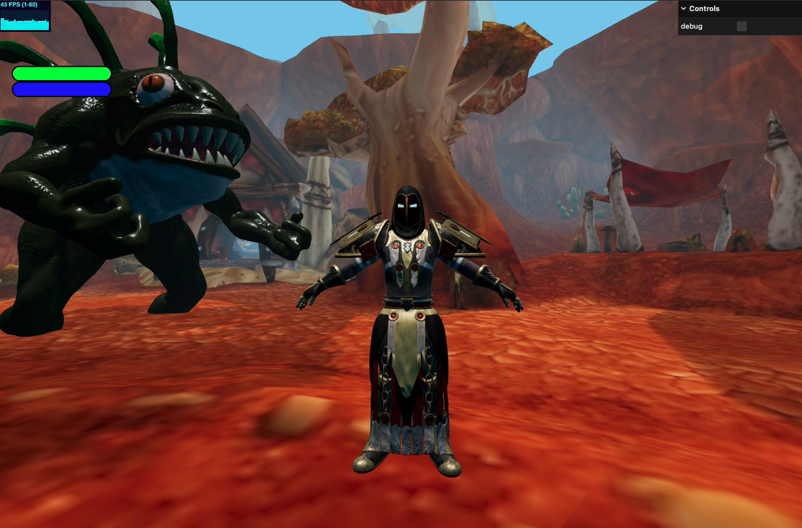

# Multiplayer 3D Game

A multiplayer 3D game built with **React**, **Three.js**, and WebSockets, featuring real-time player movement, character animations, health and mana management, and interactive fireball mechanics.

## ✨ [**Link to Demo**](http://meta-wars.s3-website-us-west-2.amazonaws.com) ✨
#### Available for single run, for multiplayer need to turn on server, let me know

## Features

- **Multiplayer Interaction**: Real-time communication between players using WebSockets.
- **Character Animations**: Smooth transitions between idle, walking, and running animations.
- **Interactive Combat**: Players can throw fireballs to interact with the environment and other players.
- **Health and Mana System**: Regenerate mana over time and track health visually using HP and Mana bars.
- **Physics**: Collision detection using Octree and Capsule geometry for realistic interactions.
- **Camera Controls**: Dynamic camera follows the player with zoom and rotation options.

